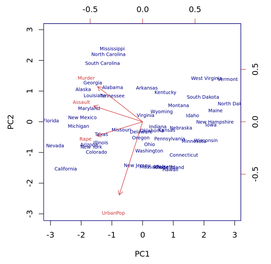

```{r setup, include=FALSE}
knitr::opts_chunk$set(echo = TRUE, comment = NA)
library(learnr); library(ggplot2); library(ade4); library(factoextra); library(Unidad2EST2)
knitr::opts_chunk$set(echo = FALSE,
                 exercise.warn_invisible = FALSE)
# colores
c1="#FF7F00" # NARANJA COLOR PRINCIPAL
c2="#034a94" # AZUL FUERTE COLOR SECUNDARIO  
c3="#0eb0c6" # AZUL CLARO COLOR TERCEARIO  
c4="#686868" # GRIS COLOR TEXTO 
#library(PerformanceAnalytics)
#library(patchwork)
#-----------------------------------------------
Theme1= theme(axis.text.x = element_blank(),
        axis.text.y = element_blank(),
        axis.ticks = element_blank(),
        axis.title.x = element_text(size = 12),
        axis.title.y = element_text(size = 12))

#-------------------------------------------------------------------------

##  <div class="content-box-blue">    </div> ## caja azul
```

## **PRESENTACIÓN**

El presente tutorial contiene preguntas relacionadas con el análisis de componentes principales (ACP)

</br>

## **CUESTIONARIO**

### **Pregunta 1**

```{r q1}

quiz(
  question("¿Cuál es el principal objetivo del análisis de componentes principales?" , 
           correct = "", 
           allow_retry = TRUE,
           answer("Modelar la variable respuesta mediante la combinación lineal de un conjunto de covariables", message = "No, pero no...intentalo de nuevo!"),
           answer("Reducir la dimensionalidad de un conjunto de datos para así poder analizarlos en una menor dimensión perdiendo la menor cantidad de información",  correct = TRUE),
           answer("Pronosticar los valores futuros de una serie de tiempo mediante medias moviles", message = "Incorrecto. Intenta de nuevo!."),
           answer("Analizar los errores de un modelo de regresión lineal", message = "No...intentalo de nuevo!"),
           submit_button = "Enviar respuesta",
           try_again_button = "Intentar de nuevo"),
  caption = " "
)

```

### **Pregunta 2**

```{r q2}

quiz(
  question("¿Qué tipos de datos se pueden analizar mediante un ACP?" , 
           correct = "", 
           allow_retry = TRUE,
           answer("Datos cualitativos nominales", message = "No, pero no...intentalo de nuevo!"),
           answer("Datos en escala de intervalo", message = "No...intentalo de nuevo!"),
           answer("Solo datos cuantitativos discretos", message = "Incorrecto. Intenta de nuevo!."),
           answer("Datos cuantitativos, tanto continuos como discretos",  correct = TRUE),
           submit_button = "Enviar respuesta",
           try_again_button = "Intentar de nuevo"),
  caption = " "
)

```

### **Pregunta 3**

```{r q3}

quiz(
  question("¿Cuál es el primer paso para realizar un ACP?" , 
           correct = "", 
           allow_retry = TRUE,
           answer("Estandarizar las variables", correct = TRUE),
           answer("Centrar cada variable, es decir, restarle su media", message = "No, pero no...intentalo de nuevo!"),
           answer("Calcular la matriz de correlaciones de las variables", message = "Incorrecto. Intenta de nuevo!."),
           answer("Calcular los vectores propios del conjunto de datos", message = "No...intentalo de nuevo!"),
           submit_button = "Enviar respuesta",
           try_again_button = "Intentar de nuevo"),
  caption = " "
)

```

### **Pregunta 4**

```{r q4}
quiz(
  question("¿Qué es la inercia o varianza explicada?" , 
           correct = "", 
           allow_retry = TRUE,
           answer("Es el porcentaje de correlación parcial de cada par de variables del conjunto de datos", message = "No, pero no...intentalo de nuevo!"),
           answer("Es la cantidad de varianza total de las variables originales que es explicada por las componentes principales",  correct = TRUE),
           answer("Es la contribución de cada individuo a la conformación de cada componente principal", message = "Incorrecto. Intenta de nuevo!."),
           answer("Es la suma de los coeficientes de correlación para cada par de variables del conjunto de datos", message = "No...intentalo de nuevo!"),
           submit_button = "Enviar respuesta",
           try_again_button = "Intentar de nuevo"),
  caption = " "
)

```

### **Pregunta 5**

```{r q5}

quiz(
  question("¿Qué relación existe entre las variables originales y las componentes principales" , 
           correct = "", 
           allow_retry = TRUE,
           answer("Las componentes principales son los valores ajustados de los modelos de regresión calculados mediante las variables originales", message = "No, pero no...intentalo de nuevo!"),
           answer("Las componentes principales son una productoria de la matriz de correlaciones", message = "No...intentalo de nuevo!"),
           answer("Las variables originales se pueden obtener realizando producto punto entre las componentes principales", message = "Incorrecto. Intenta de nuevo!."),
           answer("Las componentes principales son combinaciones lineales de las variables originales estandarizadas", correct = TRUE),
           submit_button = "Enviar respuesta",
           try_again_button = "Intentar de nuevo"),
  caption = " "
)

```

### **Pregunta 6**

```{r q6}

quiz(
  question("¿Cuantas serán el total de componentes a retener?" , 
           correct = "", 
           allow_retry = TRUE,
           answer("n: número de individuos", message = "No, pero no...intentalo de nuevo!"),
           answer("p: número de variables",  correct = TRUE),
           answer("n-p", message = "Incorrecto. Intenta de nuevo!."),
           answer("n*p", message = "No...intentalo de nuevo!"),
           submit_button = "Enviar respuesta",
           try_again_button = "Intentar de nuevo"),
  caption = " "
)

```

### **Pregunta 7**

La siguiente representación simultanea proviene del ACP calculado sobre la base de datos USArrests la cual viene por defecto en R, las variables son Urbanpop (cantidad de población urbana), Assault (asaltos), Murder (asesinatos) y Rape (secuestros), estás tres ultimas variables están dadas en tasas por cada 100.000 habitantes.

<center>
```{r, echo=FALSE, out.width="80%", fig.align = "center"}

```
</center>

```{r q7}
quiz(
  question("NO es correcto afirmar que:" , 
           correct = "", 
           allow_retry = TRUE,
           answer("La tasa de asaltos está altamente correlacionada con la tasa de asesinatos", message = "No, pero no...intentalo de nuevo!"),
           answer("South Carolina, North Carolina y Missisipi se caracterizan por tener tasas bajas de asesinatos",  correct = TRUE),
           answer("Florida, Nevada y California se caracterizan por tener altas tasas de secuestros y asaltos", message = "Incorrecto. Intenta de nuevo!."),
           answer("South Dakota, Maine, West Virgin y Vermont se caracterizan por tener tasas bajas de secuestros y asaltos", message = "No...intentalo de nuevo!"),
           submit_button = "Enviar respuesta",
           try_again_button = "Intentar de nuevo"),
  caption = " "
)

```

## **PROBLEMAS**

### **Problema 1**
Este tutorial cuenta con la base de datos "beer2" (la cual se puede acceder mediante la función data("beer2")), se cuenta con 69 marcas de cervezas con las variables precio, cantidad de calorias y porcentaje de alcohol:

```{r}
data("beer2")
beer2
```

**Calcule el ACP correspondiente usando las variables precio, calorias y poralcoh, con la matriz original estandarizada y usando las librerias ade4 y factoextra.**

```{r p1, exercise=TRUE, exercise.lines = 5}

```
```{r p1-hint}
library(ade4); library(factoextra)
ACP = dudi.pca()
```
```{r p1-solution}
library(ade4); library(factoextra)
ACP = dudi.pca(beer2, scannf=FALSE, center = TRUE, scale = TRUE)
```


### **Problema 1.1**
**Encuentre los valores propios asociados a la matriz de correlaciones:**

```{r p0, exercise=TRUE, exercise.lines = 5}
ACP = dudi.pca(beer2, scannf=FALSE, center = TRUE, scale = TRUE) #no borrar este codigo
#escribe aqui tu codigo
```
```{r p0-hint}
Object$eig
```
```{r p0-solution}
ACP$eig
```
### **Problema 1.2**
**Calcule las componentes principales de los individuos:**

```{r p2, exercise=TRUE, exercise.lines = 5}
ACP = dudi.pca(beer2, scannf=FALSE, center = TRUE, scale = TRUE)

```
```{r p2-hint}
Object$li
```
```{r p2-solution}
ACP$li
```

### **Problema 1.3**
**Calcule las componentes principales de las variables:**

```{r p3, exercise=TRUE, exercise.lines = 5}
ACP = dudi.pca(beer2, scannf=FALSE, center = TRUE, scale = TRUE)

```
```{r p3-hint}
Object$co
```
```{r p3-solution}
ACP$co
```

### **Problema 1.4**
**Represente el circulo de correlaciones (representación de variables):**
```{r p5, exercise=TRUE, exercise.lines = 5}
ACP = dudi.pca(beer2, scannf=FALSE, center = TRUE, scale = TRUE)

```
```{r p5-hint}
fviz_pca_var()
```
```{r p5-solution}
fviz_pca_var(ACP)
```

### **Problema 1.5**
```{r q8}
quiz(
  question("El porcentaje de varianza explicada en el primer plano factorial es del:" , 
           correct = "", 
           allow_retry = TRUE,
           answer("70.5%", message = "No, pero no...intentalo de nuevo!"),
           answer("26%", message = "No...intentalo de nuevo!"),
           answer("100%", message = "Incorrecto. Intenta de nuevo!."),
           answer("96.5%", correct = TRUE),
           submit_button = "Enviar respuesta",
           try_again_button = "Intentar de nuevo"),
  caption = " "
)

```

### **Problema 1.6**
```{r q9}
quiz(
  question("Sobre las variables es CORRECTO afirmar que:" , 
           correct = "", 
           allow_retry = TRUE,
           answer("La cantidad de calorias está altamente correlacionada con el porcentaje de alcohol", correct = TRUE),
           answer("A medida que aumentan las calorias el porcentaje de alcohol va a disminuir", message = "No, pero no...intentalo de nuevo!"),
           answer("A medida que aumente el precio la cantidad de calorias va a disminuir", message = "Incorrecto. Intenta de nuevo!."),
           answer("Ninguna de las variables está relacionada", message = "No...intentalo de nuevo!"),
           submit_button = "Enviar respuesta",
           try_again_button = "Intentar de nuevo"),
  caption = " "
)

```
### **Problema 1.7**
**Muestre la representación simultanea de individuos y variables en el primer plano factorial**
```{r p6, exercise=TRUE, exercise.lines = 5}
ACP = dudi.pca(beer2, scannf=FALSE, center = TRUE, scale = TRUE)

```
```{r p6-hint}
fviz_pca_biplot()
```
```{r p6-solution}
fviz_pca_biplot(ACP)
```
### **Problema 1.8**
```{r q10}
quiz(
  question("De acuerdo al ACP es correcto afirmar que:" , 
           correct = "", 
           allow_retry = TRUE,
           answer("Las cervezas 21, 23, 26 y 40 tienen los precios más bajos y la cantidad de calorias más altas.", message = "No...intentalo de nuevo!"),
           answer("La cerveza 18 tiene precios muy altos, además de cantidad de calorias y porcentaje de alcohol bajos.", message = "No, pero no...intentalo de nuevo!"),
           answer("Altos porcentajes de alcohol están relacionados con precios y calorias muy bajos", message = "Incorrecto. Intenta de nuevo!."),
           answer("Las cervezas 63, 64, 65, 66 y 67 se caracterizan por tener la menor cantidad de calorias y porcentaje de alcohol", correct = TRUE),
           submit_button = "Enviar respuesta",
           try_again_button = "Intentar de nuevo"),
  caption = " "
)

```

### **Problema 1.8**
A continuación se muestran las contribuciones de las variables a las componentes principales:

```{r}
ACP = dudi.pca(beer2, scannf=FALSE, center = TRUE, scale = TRUE)
inercia.ACP = inertia.dudi(ACP,row.inertia=TRUE, col.inertia=TRUE)
inercia.ACP$col.abs
```
```{r q11}
quiz(
  question("De acuerdo a las contribuciones anteriores es CORRECTO afirmar que:" , 
           correct = "", 
           allow_retry = TRUE,
           answer("La variable que más aporta a la varianza total de la primera componente es el precio ", message = "Incorrecto. Intenta de nuevo!."),
           answer("La variable que más aporta a la varianza total de la segunda componente son las calorias", message = "No, pero no...intentalo de nuevo!"),
           answer("La variable que más aporta a la varianza total de la primera componente son las calorias", correct = TRUE),
           answer("Todas variables aportan la misma varianza explicada a la primera componente", message = "No...intentalo de nuevo!"),
           submit_button = "Enviar respuesta",
           try_again_button = "Intentar de nuevo"),
  caption = " "
)

```


