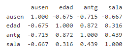

```{r setup, include=FALSE}
knitr::opts_chunk$set(echo = TRUE, comment = NA)
library(learnr)
library(ggplot2)
knitr::opts_chunk$set(echo = FALSE, exercise.warn_invisible = FALSE)
# colores
c1="#FF7F00" # NARANJA COLOR PRINCIPAL
c2="#034a94" # AZUL FUERTE COLOR SECUNDARIO  
c3="#0eb0c6" # AZUL CLARO COLOR TERCEARIO  
c4="#686868" # GRIS COLOR TEXTO 
#library(PerformanceAnalytics)
#library(patchwork)
#-----------------------------------------------
Theme1= theme(axis.text.x = element_blank(),
        axis.text.y = element_blank(),
        axis.ticks = element_blank(),
        axis.title.x = element_text(size = 12),
        axis.title.y = element_text(size = 12))

#-------------------------------------------------------------------------
```
## **PRESENTACIÓN**

El siguiente tutorial contiene preguntas relacionadas con conceptos básicos sobre regresión lineal multiple, correlación, algebra lineal y notación matricial pertenecientes a la unidad 2 del curso "Métodos estadísticos y simulación".

## **Modelo de Regresión Lineal Múltiple**

### **Pregunta 1**

¿Cúal de las siguientes es la forma general de la ecuación del modelo de regresión multiple? <br>

-   a\) $X_{i1} + \beta_2X_{i2} + \cdots+ \beta_kX_{ik} + \varepsilon_i$\$
-   b\) $Y_i = \beta_0 + \beta_1X_{i1} + \beta_2X_{i2} + \cdots+ \beta_kX_{ik} + \varepsilon_i$
-   c\) $Y_i = \beta_0 + \beta_1X_{i1} + \beta_2X_{i2} + \cdots+ \beta_kX_{ik}$
-   d\) $Y_i = \beta_0^{2} + \beta_1^{2}X_{i1} + \beta_2^{2}X_{i2} + \cdots+ \beta_k^{2}X_{ik} + \varepsilon_i$

```{r quiz_1}

quiz(
  question("La respuesta correcta es:" , 
           correct = " ", 
           allow_retry = TRUE,
           answer("a", message = "No, pero no...intentalo de nuevo!"),
           answer("b",  correct = TRUE),
           answer("c", message = "Incorrecto. Intenta de nuevo!."),
           answer("d", message = "No...intentalo de nuevo!"),
           # Si no cambiamos estos textos en los botones, se mostrarán en Inglés  
           submit_button = "Enviar respuesta",
           try_again_button = "Intentar de nuevo"),
           # Si no ponemos un caption aparecerá la palabra Quiz en inglés.
  caption = " "
)

```

### **Pregunta 2**

¿Cúal de la distribución de probabilidad de los errores de un modelo de regresión lineal? <br>

-   a\) $\epsilon_{i} \thicksim Normal(0, 1)$
-   b\) $\epsilon_{i} \thicksim Uniforme(0, 1)$
-   c\) $\epsilon_{i} \thicksim Normal(0, \sigma^2)$
-   d\) Puede tomar cualquier distribución.

```{r quiz_2}

quiz(
  question("La respuesta correcta es:" , 
           correct = " ", 
           allow_retry = TRUE,
           answer("a", message = "No, pero no...intentalo de nuevo!"),
           answer("b",  message = "Incorrecto. Intenta de nuevo!."),
           answer("c", correct = TRUE),
           answer("d", message = "No...intentalo de nuevo!"),
           # Si no cambiamos estos textos en los botones, se mostrarán en Inglés  
           submit_button = "Enviar respuesta",
           try_again_button = "Intentar de nuevo"),
           # Si no ponemos un caption aparecerá la palabra Quiz en inglés.
  caption = " "
)

```

### **Pregunta 3**

¿Cuales son los supuestos sobre de los errores de un modelo de regresión lineal multiple? <br>

```{r quiz_3}

quiz(
  question("" , 
           correct = " ", 
           allow_retry = TRUE,
           answer("Normalidad, independencia, varianza constante y media cero", correct = TRUE),
           answer("Normalidad, varianza heterogenea, independencia y media cero", message = "No, pero no...intentalo de nuevo!"),
           answer("No tienen supuestos", message = "Incorrecto. Intenta de nuevo!."),
           answer("Normalidad y varianza constante", message = "No...intentalo de nuevo!"),
           # Si no cambiamos estos textos en los botones, se mostrarán en Inglés  
           submit_button = "Enviar respuesta",
           try_again_button = "Intentar de nuevo"),
           # Si no ponemos un caption aparecerá la palabra Quiz en inglés.
  caption = " "
)

```

### **Pregunta 4**

De que forma se pueden interpretar los coeficientes de regresión ${\beta_j ~~donde\hspace{.3cm} j = 1, 2, \dots, k}:$ <br>

-   a\) Indican el cambio en la respuesta media de ${Y}$ por unidad de incremento en el logaritmo de la respectiva variable ${X_j}$, cuando las demás predictoras permanecen constantes.
-   b\) Indican el cambio en la respuesta media de ${Y}$ por unidad de incremento en la respectiva variable ${X_j}$, cuando las demás predictoras permanecen constantes.
-   c\) Indican el cambio en la respuesta media de ${Y}$ por unidad de incremento en la respectiva variable ${X_j}$, cuando las demás predictoras toman distintos valores no constantes.
-   d\) Indican el cambio en la respuesta media de ${Y}$ por incremento del 200% en la respectiva variable ${X_j}$, cuando las demás predictoras permanecen constantes.

```{r quiz_4}

quiz(
  question("La respuesta correcta es:" , 
           correct = " ", 
           allow_retry = TRUE,
           answer("a", message = "No, pero no...intentalo de nuevo!"),
           answer("b",  correct = TRUE),
           answer("c", message = "Incorrecto. Intenta de nuevo!."),
           answer("d", message = "No...intentalo de nuevo!"),
           # Si no cambiamos estos textos en los botones, se mostrarán en Inglés  
           submit_button = "Enviar respuesta",
           try_again_button = "Intentar de nuevo"),
           # Si no ponemos un caption aparecerá la palabra Quiz en inglés.
  caption = " "
)

```

## **Correlación**

### **Pregunta 5**

¿Para que se usa el coeficiente de correlación? <br>

```{r quiz_5}

quiz(
  question("" , 
           correct = " ", 
           allow_retry = TRUE,
           answer("Mide la intensidad de la relación exponencial que existe entre las variables independientes.", message = "No, pero no...intentalo de nuevo!"),
           answer("Permite predecir valores de la variable respuesta mediante las variables predictoras.", message = "No...intentalo de nuevo!"),
           answer("Permite calcular los coeficientes de regresión.", message = "Incorrecto. Intenta de nuevo!."),
           answer("Mide la intensidad de la relación lineal que existe entre las variables independientes.", correct
                  = TRUE),
           # Si no cambiamos estos textos en los botones, se mostrarán en Inglés  
           submit_button = "Enviar respuesta",
           try_again_button = "Intentar de nuevo"),
           # Si no ponemos un caption aparecerá la palabra Quiz en inglés.
  caption = " "
)

```

### **Pregunta 6**

¿Qué sucede si existen relaciones lineales fuertes entre las variables predictoras? <br>

```{r quiz_6}

quiz(
  question("" , 
           correct = "La multicolinealidad provoca que exista información que podría ser redundante en el modelo", 
           allow_retry = TRUE,
           answer("Provocaria multicolinealidad dentro del modelo.", correct = TRUE),
           answer("Se presentaría heterogeneidad en los residuos.", message = "No, pero no...intentalo de nuevo!"),
           answer("Los coeficientes de regresión no tendrían interpretacion.", message = "Incorrecto. Intenta de nuevo!."),
           answer("Los errores no tendrían distribución normal", message = "No...intentalo de nuevo!"),
           # Si no cambiamos estos textos en los botones, se mostrarán en Inglés  
           submit_button = "Enviar respuesta",
           try_again_button = "Intentar de nuevo"),
           # Si no ponemos un caption aparecerá la palabra Quiz en inglés.
  caption = " "
)

```

### **Pregunta 7**

De acuerdo a la siguiente matriz de correlaciones, ¿Entre cuales variables existe la correlación lineal más fuerte? <br>

<center>
{width="40%"}
</center>

```{r quiz_7}

quiz(
  question("La respuesta correcta es:" , 
           correct = " ", 
           allow_retry = TRUE,
           answer("Entre ausen y edad", message = "No, pero no...intentalo de nuevo!"),
           answer("Entre sala y antg", message = "No...intentalo de nuevo!"),
           answer("Entre antg y edad", correct = TRUE),
           answer("Entre ausen y sala", message = "Incorrecto. Intenta de nuevo!."),
           # Si no cambiamos estos textos en los botones, se mostrarán en Inglés  
           submit_button = "Enviar respuesta",
           try_again_button = "Intentar de nuevo"),
           # Si no ponemos un caption aparecerá la palabra Quiz en inglés.
  caption = " "
)

```


## **Algebra Lineal**

### **Pregunta 8**

Indica cual de las siguientes propiedades es incorrecta dado que $\boldsymbol{A}$ es una matriz de constantes de orden $n\times n$, $\boldsymbol{x} = \left[ x_1, \ldots, x_n\right]'$ un vector de variables de orden $n\times 1$ y $\boldsymbol{a}$ un vector de constantes de orden $n\times 1$. <br>

-   a\) $\dfrac{\partial\left(\boldsymbol{a}'\boldsymbol{x}\right)}{\partial\boldsymbol{x}} = \dfrac{\partial\left(\boldsymbol{x}'\boldsymbol{a}\right)}{\partial\boldsymbol{x}} = \boldsymbol{a}$
-   b\) $\dfrac{\partial\left(\boldsymbol{a}'\boldsymbol{x}\right)}{\partial\boldsymbol{x}} = \dfrac{\partial\left(\boldsymbol{x}'\boldsymbol{a}\right)}{\partial\boldsymbol{x}} = \boldsymbol{a^2}$
-   c\) $\dfrac{\partial\left(\boldsymbol{x}'\boldsymbol{Ax}\right)}{\partial\boldsymbol{x}} = \boldsymbol{Ax} + \boldsymbol{A}'\boldsymbol{x}$, pero si $\boldsymbol{A}$ es simétrica, entonces $\dfrac{\partial\left(\boldsymbol{x}'\boldsymbol{Ax}\right)}{\partial\boldsymbol{x}} = 2\boldsymbol{Ax}$
-   d\) $\dfrac{\partial\left(\boldsymbol{x}'\boldsymbol{x}\right)}{\partial\boldsymbol{x}} = 2\boldsymbol{x}$

```{r quiz_8}

quiz(
  question("La respuesta correcta es:" , 
           correct = " ", 
           allow_retry = TRUE,
           answer("a", message = "No, pero no...intentalo de nuevo!"),
           answer("b", correct = TRUE),
           answer("c", message = "No...intentalo de nuevo!"),
           answer("d", message = "Incorrecto. Intenta de nuevo!."),
           # Si no cambiamos estos textos en los botones, se mostrarán en Inglés  
           submit_button = "Enviar respuesta",
           try_again_button = "Intentar de nuevo"),
           # Si no ponemos un caption aparecerá la palabra Quiz en inglés.
  caption = " "
)

```

### **Pregunta 9**

Una forma cuadrática se puede expresar matricialmente como:<br>

-   a\) $\boldsymbol{xA}'\boldsymbol{x}$
-   b\) $\boldsymbol{xA}'\boldsymbol{xx}$
-   c\) $I\boldsymbol{Ax}$
-   d\) $\boldsymbol{x}'\boldsymbol{Ax}$

```{r quiz_9}

quiz(
  question("La respuesta correcta es:" , 
           correct = " ", 
           allow_retry = TRUE,
           answer("a", message = "No, pero no...intentalo de nuevo!"),
           answer("b", message = "No...intentalo de nuevo!"),
           answer("c", message = "Incorrecto. Intenta de nuevo!."),
           answer("d", correct = TRUE),
           # Si no cambiamos estos textos en los botones, se mostrarán en Inglés  
           submit_button = "Enviar respuesta",
           try_again_button = "Intentar de nuevo"),
           # Si no ponemos un caption aparecerá la palabra Quiz en inglés.
  caption = " "
)

```


### **Pregunta 10**

Sean $\boldsymbol{A}$ y $\boldsymbol{B}$ matrices de constantes de orden $n\times n$ y $m\times n$ respectivamente, el producto $(BA)^{'}$ es igual a: <br>

-   a\) $B^{'}A{'}$
-   b\) $B^{'} + A{'}$
-   c\) $AB^{'}$
-   d\) $A^{'}B^{'}$

```{r quiz_10}

quiz(
  question("La respuesta correcta es:" , 
           correct = " ", 
           allow_retry = TRUE,
           answer("a", message = "No, pero no...intentalo de nuevo!"),
           answer("b", message = "No...intentalo de nuevo!"),
           answer("c", message = "Incorrecto. Intenta de nuevo!."),
           answer("d", correct = TRUE),
           # Si no cambiamos estos textos en los botones, se mostrarán en Inglés  
           submit_button = "Enviar respuesta",
           try_again_button = "Intentar de nuevo"),
           # Si no ponemos un caption aparecerá la palabra Quiz en inglés.
  caption = " "
)

```


### **Pregunta 11**

Sea la matriz $\boldsymbol{A}$ matriz de constantes de orden $n\times n$ y $\boldsymbol{x} = \left[ x_1, \ldots, x_n\right]'$ un vector de variables de orden $n\times 1$, se dice que es A es definida positiva si: <br>

-   a\) $\boldsymbol{x}'\boldsymbol{Ax} \leq 0,\; \forall\boldsymbol{x}$.
-   b\) $\boldsymbol{x}'\boldsymbol{Ax} < 0,\; \forall\boldsymbol{x}$.
-   c\) $\boldsymbol{x}'\boldsymbol{Ax} \geq 0,\; \forall\boldsymbol{x}$.
-   d\) $\boldsymbol{x}'\boldsymbol{Ax} > 0,\; \forall\boldsymbol{x}$.

```{r quiz_11}

quiz(
  question("La respuesta correcta es:" , 
           correct = " ", 
           allow_retry = TRUE,
           answer("a", message = "No, pero no...intentalo de nuevo!"),
           answer("b", message = "No...intentalo de nuevo!"),
           answer("c", message = "Incorrecto. Intenta de nuevo!."),
           answer("d", correct = TRUE),
           # Si no cambiamos estos textos en los botones, se mostrarán en Inglés  
           submit_button = "Enviar respuesta",
           try_again_button = "Intentar de nuevo"),
           # Si no ponemos un caption aparecerá la palabra Quiz en inglés.
  caption = " "
)

```


## **Notación Matricial**

### **Pregunta 12**

Sean $Y$ un vector de valores de $y$, variable dependiente ($dim = n \times 1$), $X$ una matriz que contiene los valores de las $k$ variables independientes ($dim = n \times k$) y $\varepsilon$ un vector de errores ($dim = n \times 1$), la forma general de expresar el modelo de regresión multiple es: <br>

-   a\) $Y = X \beta$
-   b\) $E(Y | X) = X \beta + \varepsilon$
-   c\) $Y = X^2 \beta + \varepsilon$
-   d\) $Y = X \beta + \varepsilon$

```{r quiz_12}

quiz(
  question("La respuesta correcta es:" , 
           correct = " ", 
           allow_retry = TRUE,
           answer("a", message = "No, pero no...intentalo de nuevo!"),
           answer("b", message = "No...intentalo de nuevo!"),
           answer("c", message = "Incorrecto. Intenta de nuevo!."),
           answer("d", correct = TRUE),
           # Si no cambiamos estos textos en los botones, se mostrarán en Inglés  
           submit_button = "Enviar respuesta",
           try_again_button = "Intentar de nuevo"),
           # Si no ponemos un caption aparecerá la palabra Quiz en inglés.
  caption = " "
)

```


### **Pregunta 13**

La expresión matricial de la matriz de varianzas-covarianzas es: <br>

-   a\) $$\boldsymbol{\Sigma_y} = V(\boldsymbol{y}) = \begin{bmatrix}
    1 &0 &\cdots &0\\
    0 &1 &\cdots &0\\
    \vdots &\vdots &\ddots &\vdots\\
    0 &0 &\cdots &1
    \end{bmatrix}$$
    
-   b\) $$\boldsymbol{\Sigma_y} = V(\boldsymbol{y}) = \begin{bmatrix}
    \sigma^{2}_{1} &0 &\cdots &0\\
    0 &\sigma^{2}_{2} &\cdots &0\\
    \vdots &\vdots &\ddots &\vdots\\
    0 &0 &\cdots &\sigma^{2}_{n}
    \end{bmatrix}$$
    
-   c\) $$
    \boldsymbol{\Sigma_y} = V(\boldsymbol{y}) =\begin{bmatrix}
    \sigma^2_1 &\sigma_{12} &\cdots &\sigma_{1n}\\
    \sigma_{12} &\sigma^2_2 &\cdots &\sigma_{2n}\\
    \vdots &\vdots &\ddots &\vdots\\
    \sigma_{1n} &\sigma_{2n} &\cdots &\sigma^2_n
    \end{bmatrix}
    $$
    
-   d\) $$\boldsymbol{\Sigma_y} = V(\boldsymbol{y}) = \begin{bmatrix}
    \sigma_{11} &0 &\cdots &0\\
    0 &\sigma_{22} &\cdots &0\\
    \vdots &\vdots &\ddots &\vdots\\
    0 &0 &\cdots &\sigma_{nn}
    \end{bmatrix}$$

```{r quiz_13}

quiz(
  question("La respuesta correcta es:" , 
           correct = " ", 
           allow_retry = TRUE,
           answer("a", message = "No, pero no...intentalo de nuevo!"),
           answer("b", message = "Incorrecto. Intenta de nuevo!."),
           answer("c", correct = TRUE),
           answer("d", message = "No...intentalo de nuevo!"),
           # Si no cambiamos estos textos en los botones, se mostrarán en Inglés  
           submit_button = "Enviar respuesta",
           try_again_button = "Intentar de nuevo"),
           # Si no ponemos un caption aparecerá la palabra Quiz en inglés.
  caption = " "
)

```


### **Pregunta 14**

Por fuera de la diagonal de la matriz de varianzas-covarianzas asociada a un vector aleatorio están:<br>


```{r quiz_14}

quiz(
  question("" , 
           correct = " ", 
           allow_retry = TRUE,
           answer("Las varianzas asociadas a cada elemento del vector aleatorio.", message = "No, pero no...intentalo de nuevo!"),
           answer("Las esperanzas condicionales entre los pares de elementos del vector aleatorio.", message = "No...intentalo de 
                  nuevo!"),
           answer("Los coeficientes de correlaciones asociados a cada elemento del vector aleatorio.", message = "Incorrecto. Intenta de nuevo!."),
           answer("Las covarianzas entre los pares de elementos del vector aleatorio.", correct = TRUE),
           # Si no cambiamos estos textos en los botones, se mostrarán en Inglés  
           submit_button = "Enviar respuesta",
           try_again_button = "Intentar de nuevo"),
           # Si no ponemos un caption aparecerá la palabra Quiz en inglés.
  caption = " "
)

```


### **Pregunta 15**

Selecciona cual NO es una propiedad de $E(y)$ y $V(y)$: <br>

-   a\) $E\left[\boldsymbol{Ay + b}\right] = E\left[\boldsymbol{Ay}\right] + E\left[\boldsymbol{b}\right] = \boldsymbol{A\mu_y} + \boldsymbol{b}$.
-   b\) $V\left[\boldsymbol{Ay + b}\right] = V\left[\boldsymbol{Ay}\right] + V\left[\boldsymbol{b}\right] = \boldsymbol{A\ \Sigma_y} + \boldsymbol{0} = \boldsymbol{A\ \Sigma_y}$.
-   c\) $E\left[\boldsymbol{Ay}\right] = \boldsymbol{A}E\left[\boldsymbol{y}\right] = \boldsymbol{A\mu_y}$.
-   d\) $V\left[\boldsymbol{Ay}\right] = \boldsymbol{A}\ V\left[\boldsymbol{y}\right]\boldsymbol{A}' = \boldsymbol{A\ \Sigma_y\,A}'$.

```{r quiz_15}

quiz(
  question("La respuesta correcta es:" , 
           correct = " ", 
           allow_retry = TRUE,
           answer("a", message = "No, pero no...intentalo de nuevo!"),
           answer("b",  correct = TRUE),
           answer("c", message = "Incorrecto. Intenta de nuevo!."),
           answer("d", message = "No...intentalo de nuevo!"),
           # Si no cambiamos estos textos en los botones, se mostrarán en Inglés  
           submit_button = "Enviar respuesta",
           try_again_button = "Intentar de nuevo"),
           # Si no ponemos un caption aparecerá la palabra Quiz en inglés.
  caption = " "
)

```


