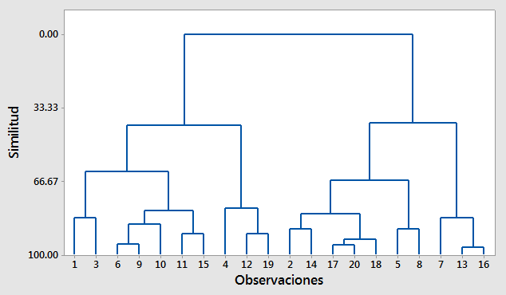

```{r setup, include=FALSE}
knitr::opts_chunk$set(echo = TRUE, comment = NA)
library(learnr); library(ggplot2); library(Unidad2EST2); library(FactoMineR); library(ade4); library(factoextra)
knitr::opts_chunk$set(echo = FALSE,
                 exercise.warn_invisible = FALSE)
# colores
c1="#FF7F00" # NARANJA COLOR PRINCIPAL
c2="#034a94" # AZUL FUERTE COLOR SECUNDARIO  
c3="#0eb0c6" # AZUL CLARO COLOR TERCEARIO  
c4="#686868" # GRIS COLOR TEXTO 
#library(PerformanceAnalytics)
#library(patchwork)
#-----------------------------------------------
Theme1= theme(axis.text.x = element_blank(),
        axis.text.y = element_blank(),
        axis.ticks = element_blank(),
        axis.title.x = element_text(size = 12),
        axis.title.y = element_text(size = 12))

#-------------------------------------------------------------------------

##  <div class="content-box-blue">    </div> ## caja azul
```

## **PRESENTACIÓN**

El presente tutorial contiene preguntas relacionadas con el análisis de conglomerados (clustering):

</br>

## **CUESTIONARIO**

### **Pregunta 1**

```{r q1}

quiz(
  question("¿Cuál es el objetivo principal del análisis de conglomerados?" , 
           correct = "", 
           allow_retry = TRUE,
           answer("Emplear técnicas de mineria de datos para encontrar componentes principales"),
           answer("Agrupar objetos similares en categorías o clusters basándose en su similitud y diferencias en sus características o variables.",  correct = TRUE),
           answer("Agrupar objetos de acuerdo a su disimilitud", message = "Incorrecto. Intenta de nuevo!."),
           answer("Analizar los errores de un modelo de regresión lineal", message = "No...intentalo de nuevo!"),
           submit_button = "Enviar respuesta",
           try_again_button = "Intentar de nuevo"),
  caption = " "
)

```

### **Pregunta 2**

```{r q2}

quiz(
  question("¿Qué tipos de datos se pueden analizar con el análisis de conglomerados?" , 
           correct = "", 
           allow_retry = TRUE,
           answer("Datos cuantitativos y cualitativos",  correct = TRUE),
           answer("Solo datos cuantitativos contintuos", message = "No...intentalo de nuevo!"),
           answer("Solo datos cuantitativos discretos", message = "Incorrecto. Intenta de nuevo!."),
           answer("Solo datos cualitativos", message = "No, pero no...intentalo de nuevo!"),
           submit_button = "Enviar respuesta",
           try_again_button = "Intentar de nuevo"),
  caption = " "
)

```

### **Pregunta 3**

```{r q3}

quiz(
  question("¿Qué es la medida de similitud en el análisis de conglomerados?" , 
           correct = "", 
           allow_retry = TRUE,
           answer("Es una medida númerica que mide la correlación entre dos individuos", message = "No...intentalo de nuevo!"),
           answer("Es una medida en escala de intervalo que permite evaluar la similitud entre dos objetos o grupos", message = "No, pero no...intentalo de nuevo!"),
           answer("Es una medida de bondad de ajuste del análisis de conglomerados", message = "Incorrecto. Intenta de nuevo!."),
           answer("Es una medida numérica para evaluar la similitud o diferencia entre dos objetos o grupos", correct = TRUE),
           submit_button = "Enviar respuesta",
           try_again_button = "Intentar de nuevo"),
  caption = " "
)

```

### **Pregunta 4**

```{r q4}
quiz(
  question("¿Qué son los dendrogramas y cómo se interpretan?" , 
           correct = "", 
           allow_retry = TRUE,
           answer("Es un tipo de diagrama de árbol utilizado para representar las correlaciones entre los n individuos de la muestra.
                  ", message = "No, pero no...intentalo de nuevo!"),
           answer("Es un tipo de diagrama de árbol utilizado para representar la relación jerárquica entre las variables y los individuos, facilitando la selección de un número k de clusters", message = "Incorrecto. Intenta de nuevo!."),
           answer("Es un tipo de diagrama de árbol utilizado para representar la relación jerárquica entre los grupos y para ayudar en la selección del número óptimo de grupos.
", correct = TRUE),
           answer("Es un tipo de diagrama de bosques que ayuda a visualizar el aporte de cada variable a un modelo de regresión", message = "No...intentalo de nuevo!"),
           submit_button = "Enviar respuesta",
           try_again_button = "Intentar de nuevo"),
  caption = " "
)

```


### **Pregunta 5**

```{r q5}

quiz(
  question("¿Cúal es el objetivo de los k-means?" , 
           correct = "", 
           allow_retry = TRUE,
           answer("Dividir un conjunto de datos en k grupos de tal manera que la suma de las distancias cuadradas entre los objetos y el centroide de su grupo correspondiente sea máxima", message = "No, pero no...intentalo de nuevo!"),
           answer("Calcular un diagrama de arbol que permitirá saber el número óptimo de grupos a utilizar", message = "No...intentalo de nuevo!"),
           answer("Calcular las componentes principales para así representar la nube de individuos y el circulo de correlaciones", message = "Incorrecto. Intenta de nuevo!."),
           answer("Dividir un conjunto de datos en k grupos de tal manera que la suma de las distancias cuadradas entre los objetos y el centroide de su grupo correspondiente sea mínima", correct = TRUE),
           submit_button = "Enviar respuesta",
           try_again_button = "Intentar de nuevo"),
  caption = " "
)

```

### **Pregunta 6**

De acuerdo al siguiente dendograma y al criterio del mayor salto de nodo a nodo de las distancias euclidianas:
<center>
```{r, echo=FALSE, out.width="70%", fig.align = "center"}

```
</center>

```{r q6}
quiz(
  question("¿Cúal es el número óptimo de grupos a calcular?" , 
           correct = "", 
           allow_retry = TRUE,
           answer("5", message = "No, pero no...intentalo de nuevo!"),
           answer("2",  correct = TRUE),
           answer("4", message = "Incorrecto. Intenta de nuevo!."),
           answer("3", message = "No...intentalo de nuevo!"),
           submit_button = "Enviar respuesta",
           try_again_button = "Intentar de nuevo"),
  caption = " "
)

```

## **PROBLEMAS**
Esta tutorial cuenta con un conjunto de datos al cual se puede acceder mediante la función *data("animals")*, esta cuenta con un total de 25 especies de animales y cinco variables en porcentaje sobre la constituyen de la leche de estos animales las cuales son: <br>
-water: porcentaje de agua. <br>
-protein: porcentaje de proteina.  <br>
-fat: porcentaje de grasa. <br>
-lactose: porcentaje de lactosa. <br>
-ash: porcentaje de cenizas. <br>

```{r}
data("animals")
animals
```
### **Problema 1**

**Mediante la libreria factoextra calcule el dendograma del conjunto de datos, primero calcule las distancias euclidianas mediante la funcion dist y despues el dendograma con la funcion hclust**

```{r p1, exercise=TRUE, exercise.lines = 5}

```
```{r p1-hint}
library(factoextra)
distancias <- dist( , method = "euclidean")
dendograma <- hclust( , method = "average")
```
```{r p1-solution}
library(factoextra)
distancias <- dist(animals, method = "euclidean")
dendograma <- hclust(animals, method = "average")
```

### **Problema 1.1**

**Represente el dendograma anteriormente calculado**

```{r p2, exercise=TRUE, exercise.lines = 5}

```
```{r p2-hint}
plot()
```
```{r p2-solution}
plot(dendograma)
```

```{r q7}
quiz(
  question("¿De acuerdo al criterio del mayor salto de nodo a nodo de las distancias euclidianas cual es el número de grupos optimo?" , 
           correct = "", 
           allow_retry = TRUE,
           answer("10", message = "No, pero no...intentalo de nuevo!"),
           answer("3",  correct = TRUE),
           answer("4", message = "Incorrecto. Intenta de nuevo!."),
           answer("5", message = "No...intentalo de nuevo!"),
           submit_button = "Enviar respuesta",
           try_again_button = "Intentar de nuevo"),
  caption = " "
)

```


### **Problema 1.2**

**Use la función kmeans para encontrar análisis de conglomerados optimo mediante kmeans, recuerde que en esta función se tiene el argumento centers el cual es el numero optimo de grupos que encontró anteriormente**

```{r p3, exercise=TRUE, exercise.lines = 5}

```
```{r p3-hint}
km <- kmeans()
```
```{r p3-solution}
km <- kmeans(x = animals, centers = 3)
```

### **Problema 1.3**

**Muestre los clusters encontrados en el punto anterior**

```{r p4, exercise=TRUE, exercise.lines = 5}
km <- kmeans(x = animals, centers = 3)

```
```{r p4-hint}
km <- kmeans()
km$
```
```{r p4-solution}
km <- kmeans(x = animals, centers = 3)
km$clusters
```

### **Problema 1.4**

**Represente gráficamente la nube de individuos y los clusters mediante la función fviz_cluster de la libreria factoextra**

```{r p5, exercise=TRUE, exercise.lines = 5}
km <- kmeans(x = animals, centers = 3)

```
```{r p5-hint}
km <- kmeans()
km$
```
```{r p5-solution}
km <- kmeans(x = animals, centers = 3)
fviz_cluster(object = km, data = animals)
```

### **Problema 1.5**

**Calcule el ACP correpondiente al conjunto de datos y grafique la representación simultanea de individuos y variables mediante la libreria ade4**

```{r p6, exercise=TRUE, exercise.lines = 5}
ACP = dudi.pca(animals, scannf=FALSE, center = TRUE, scale = TRUE)

```
```{r p6-hint}
fviz_pca_biplot()
```
```{r p6-solution}
fviz_pca_biplot(ACP)
```


