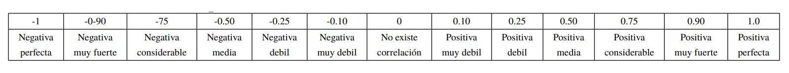
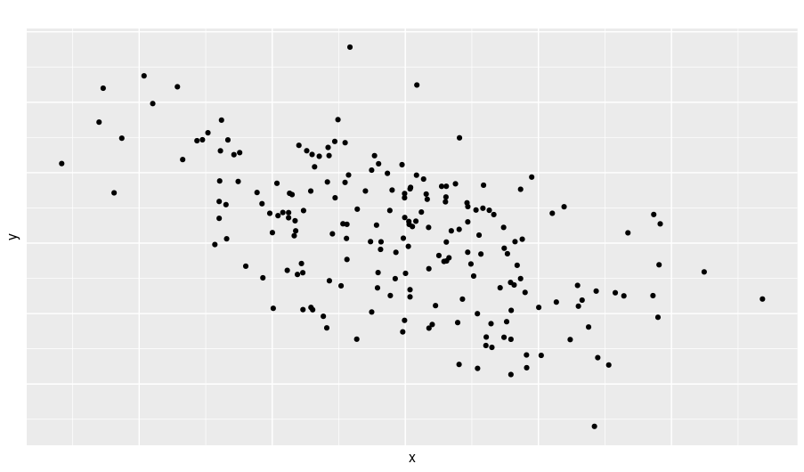
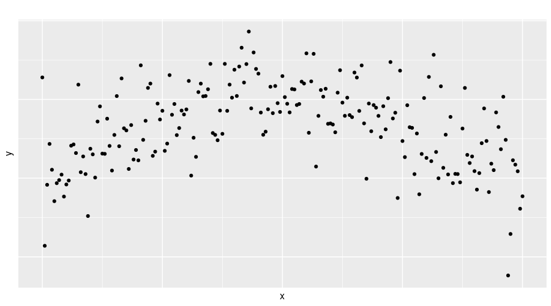

```{r setup, include=FALSE}
knitr::opts_chunk$set(echo = TRUE, comment = NA)
library(learnr)
library(ggplot2)
knitr::opts_chunk$set(echo = FALSE,
                 exercise.warn_invisible = FALSE)
# colores
c1="#FF7F00" # NARANJA COLOR PRINCIPAL
c2="#034a94" # AZUL FUERTE COLOR SECUNDARIO  
c3="#0eb0c6" # AZUL CLARO COLOR TERCEARIO  
c4="#686868" # GRIS COLOR TEXTO 
#library(PerformanceAnalytics)
#library(patchwork)
#-----------------------------------------------
Theme1= theme(axis.text.x = element_blank(),
        axis.text.y = element_blank(),
        axis.ticks = element_blank(),
        axis.title.x = element_text(size = 12),
        axis.title.y = element_text(size = 12))

#-------------------------------------------------------------------------
gen.corr.data<- function(rho,n){
x <- rnorm(n)
z <- rnorm(n)
y<- rho*x + sqrt(1-rho^2)*z
result <-cbind(y,x)
return(result)
}
library(paqueteMOD)
data("arboles")
##  <div class="content-box-blue">    </div> ## caja azul
```

## **PRESENTACIÓN**

```{r, echo=FALSE, out.width="100%", fig.align = "center"}
knitr::include_graphics("images/modulo1.png")
```

El presente tutorial contiene preguntas relacionadas con  el análisis de correlación y el modelo regresión lineal simple. A continuación se presentan un resumen  con los principales conceptos:

</br>

### **CONCEPTOS**

A continuación se relacionan los principales conceptos sobre correlación y el modelo de regresión lineal simple

</br>

#### **COEFICIENTE DE CORRELACION DE PEARSON**

El coeficiente de correlación de Pearson mide la magnitud de la **asociación lineal** entre dos variables numéricas en escala de razón.  

$$r = \dfrac{cov(x,y)}{\sqrt{s_{x}^{2}\hspace{0.1cm} s_{y}^{2}}}$$
<center>


```{r, echo=FALSE, out.width="100%", fig.align = "center"}
knitr::include_graphics("images/PlotsRho.png")
```
 
</center>

```{r, echo=FALSE, out.width="100%", fig.align = "center"}

```

<pre>
x=c(18.6, 20.6, 18.8, 21.5, 18.9, 18.6, 17.8, 19.9, 21.6, 22.1)
y=c(10.4, 11.3,  9.1, 11.0,  8.6,  9.4,  8.4, 10.3, 10.5, 11.9)
cor(x,y)
</pre>


```{r}
x=c(18.6, 20.6, 18.8, 21.5, 18.9, 18.6, 17.8, 19.9, 21.6, 22.1)
y=c(10.4, 11.3,  9.1, 11.0,  8.6,  9.4,  8.4, 10.3, 10.5, 11.9)
cor(x,y)
```


</br></br>

#### **COEFICIENTE DE CORRELACION SPEARMAN**

Este coeficiente emplea en variables numéricas en escala de intervalo, construidas como resultado de instrumentos estandarizados para medir variables latentes, que son de observación directa


<!-- ### **MAPA**  -->

```{r, echo=FALSE, , out.width="100%", fig.align = "center"}
#knitr::include_graphics("images/Indicadores.png")  

```


## **CUESTIONARIO**

### **Pregunta 1**

El siguente gráfico representa la relación entre dos variables $X$ y $Y$. 


```{r, echo=FALSE, , out.width="70%", fig.align = "center"}
  
```


```{r quiz_1}

quiz(
  question("Se puede afirmar que :" , 
           correct = "Aunque la relación entre X y Y no es perfecta, la nube de puntos si presenta una forma que permite observar una relación lineal media, .", 
           allow_retry = TRUE,
           answer("La variable X y la variable Y, tienen una relación causal", message = "No, pero no...intentalo de nuevo!"),
           answer("La variable X y la variable Y, tienen una relación lineal negativa media",  correct = TRUE),
           answer("La variable X y la variable Y, tiene una relación alta pero no lineal", message = "Incorrecto. Intenta de nuevo!."),
           answer("La variable X y la variable Y, no presentan ninguna relación estadística", message = "No...intentalo de nuevo!"),
           # Si no cambiamos estos textos en los botones, se mostrarán en Inglés  
           submit_button = "Enviar respuesta",
           try_again_button = "Intentar de nuevo"),
  # Si no ponemos un caption aparecerá la palabra Quiz en inglés.
  caption = " "
)

```


### **Pregunta 2**

```{r quiz_2}

quiz(
  question("Cuando las variables de estudio proceden de un instrumento con preguntas con respueta en escala ordinal, convertidas en escala de intervalo, el indicador apropiado para medir la asociación de la suma de resultados obtenidos por las persoanas para diferentes factores del instrumento es: ", 
           correct = "Correcto!, el coeficiente de correlación de Spearman corresponde a un indicador no paramétrico que se utiliza en variables numéricas de escala de intervalo.", 
           allow_retry = TRUE,
           answer("Coeficiente de Pearson", message = "No, pero...intentalo de nuevo!"),
           answer("Coeficiente de Spearman", correct = TRUE),
           answer("Coeficiente Tau b de Kendal", message = "Incorrecto. Intenta de nuevo!."),
           answer("Coeficiente Eta", message = "No...intentalo de nuevo!"),
           # Si no cambiamos estos textos en los botones, se mostrarán en Inglés  
           submit_button = "Enviar respuesta",
           try_again_button = "Intentar de nuevo"),
  # Si no ponemos un caption aparecerá la palabra Quiz en inglés.
  caption = " "
)

```


### **Pregunta 3**

```{r quiz_3}

quiz(
  question("El coeficiente de correlación toma su signo positivo o negativo", 
           correct = "Correcto!, el coeficiente se obtiena al dividir la cov(x,y) con la raiz cuadra de la multiplicación de las varianzas de X y Y. , . Donde las varianza son siempre positivas. El signo entonces está asociado con la covarianza. Cov(X,Y)=E(XY)-E(X)E(Y)", 
           allow_retry = TRUE,
           answer("Del valor esperado de X, E[X]", message = "No...intentalo de nuevo!"),
           answer("Del valor esperado de Y, E[Y]", message = "No...intentalo de nuevo!"),
           answer("De la varianza de X por la varianza de Y, V[X]V[Y]", message = "Incorrecto. Intenta de nuevo!."),
           answer("Del valor esperado conjunto de X y Y , E[XY] ", correct = TRUE),
           # Si no cambiamos estos textos en los botones, se mostrarán en Inglés  
           submit_button = "Enviar respuesta",
           try_again_button = "Intentar de nuevo"),
  # Si no ponemos un caption aparecerá la palabra Quiz en inglés.
  caption = " "
)

```

### **Pregunta 4**


```{r, echo=FALSE, , out.width="70%", fig.align = "center"}
  
```

```{r quiz_4}

quiz(
  question("De la gráfica se puede afirmar", 
           correct = "Correcto!, existe una relación cuadrática entre las variables.", 
           allow_retry = TRUE,
           answer("Existe una relación lineal positiva", message = "Cerca, pero no...intentalo de nuevo!"),
           answer("Existe una relación lineal negativa", message = "Nop...intentalo de nuevo!"),
           answer("No existe una relación lineal", message = "Incorrecto. Intenta de nuevo!."),
           answer("Existe relación no lineal", correct = TRUE),
           # Si no cambiamos estos textos en los botones, se mostrarán en Inglés  
           submit_button = "Enviar respuesta",
           try_again_button = "Intentar de nuevo"),
  # Si no ponemos un caption aparecerá la palabra Quiz en inglés.
  caption = "  "
)

```


### **Pregunta 5**

```{r quiz_5}

quiz(
  question("Suponga que la correlación de Pearson entre dos variables es igual a 0.56. Podemos afirmar que:", 
           correct = "Correcto!, valores cercanos a 0.50, son considerados como una fuerza lineal media.", 
           allow_retry = TRUE,
           answer("No existe una relación media entre las variables", message = "No...intentalo de nuevo!"),
           answer("La relación entre las variables es debil", message = "Nop...intentalo de nuevo!"),
           answer("La relación entre las variables muy fuerte", message = "Incorrecto. Intenta de nuevo!."),
           answer("La la relación entre las variables es media", correct = TRUE),
           # Si no cambiamos estos textos en los botones, se mostrarán en Inglés  
           submit_button = "Enviar respuesta",
           try_again_button = "Intentar de nuevo"),
  # Si no ponemos un caption aparecerá la palabra Quiz en inglés.
  caption = "  "
)

```


## **PROBLEMAS**


### **Problema 1**

Para el grupo de datos contenidos en la base arboles (data(arboles))  determine que variable (altura o diametro) tiene más relación con la variable peso. 

```{r p1, exercise=TRUE, exercise.lines = 5}
library(paqueteMOD)
data("arboles")

```


```{r p1-hint}
library(paqueteMOD)
data("arboles")
cor(,)

```


```{r p1-solution}
library(paqueteMOD)
data("arboles")
cor(arboles$peso,arboles$diametro)
cor(arboles$peso,arboles$altura)
```


### **Problema 2**

Realice las pruebas de hipótesis con las que pueda verificar si las correlaciones entre las variables : peso, diametro y altura son diferentes de cero


```{r p2, exercise=TRUE, exercise.lines = 5}
library(paqueteMOD)
data("arboles")

```


```{r p2-hint}
library(paqueteMOD)
data("arboles")
cor.test()

```


```{r p2-solution}
library(paqueteMOD)
data("arboles")
arboles=as.data.frame(arboles)
cor.test(arboles$peso,arboles$diametro)
cor.test(arboles$peso, arboles$altura)
```

